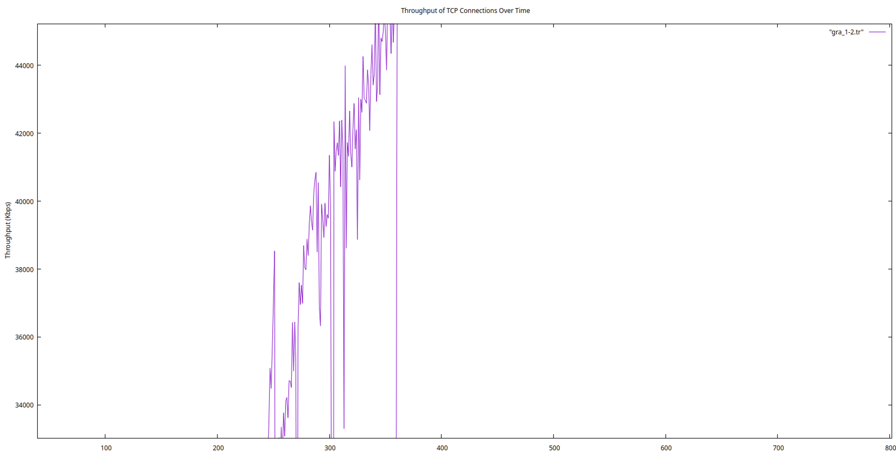

# evaluation-performance-network report

Họ và tên: Đỗ Anh Tú

Mã số sinh viên: 20021460

```bash
số node: 64
-v 1 -n 50 -t 400 -M7 -p 1 -x 670 -y 670 > 2002160.txt
```

## Bài 1

Chọn số node mạng(64): thay đổi giá trị gán cho biến nn trong wireless1.tcl (dòng: set val(nn) 3).


Sử dụng giao thức định tuyến AODV (“set val(adhocRouting) AODV”)


Sinh mẫu chuyển động (movement pattern) để sử dụng trong kịch bản mô phỏng bằng cách sử dụng công cụ setdest (version 1) có sẵn trong ns2.

```cmd
setdest -v 1 -n 50 -t 400 -M7 -p 1 -x 670 -y 670 > 20021460.txt
```

## Bài 2

### 2.1  Độ trễ định tuyến 

#### 2.1.1 Tính riêng cho từng kết nối

**Đối với ứng dụng cbr**

Thực hiện command line: 

CBR

```cmd
cat wireless1-out.tr|grep -m 34 -E '^S|DSR|cbr' | grep AGT

M 0.0 sc ./20021460.txt cp ./cbr-3-test seed 0.0
s 127.936679222 _0_ AGT  --- 0 cbr 512 [0 0 0 0] ------- [0:0 2:0 32 0] [0] 0 3
s 132.160202086 _0_ AGT  --- 1 cbr 512 [0 0 0 0] ------- [0:0 2:0 32 0] [1] 0 2
r 134.077942861 _2_ AGT  --- 0 cbr 532 [13a 2 e 800] ------- [0:0 2:0 28 2] [0] 3 3
r 134.096632956 _2_ AGT  --- 1 cbr 532 [13a 2 e 800] ------- [0:0 2:0 28 2] [1] 3 2
s 135.759450937 _0_ AGT  --- 2 cbr 512 [0 0 0 0] ------- [0:0 2:0 32 0] [2] 0 2
```
Dựa vào hướng dẫn, độ trễ dịnh tuyến được xác định cbr node 0 tới node 2 bằng:

```cmd
s 127.936679222 _0_ AGT  --- 0 cbr 512 [0 0 0 0] ------- [0:0 2:0 32 0] [0] 0 1

s 132.160202086 _0_ AGT  --- 1 cbr 512 [0 0 0 0] ------- [0:0 2:0 32 0] [1] 0 1
```

`latency_node_0_2 = 132.160202086 - 127.936679222 = 4.22352286`

**Đối với ứng dụng FTP**

TCP

```cmd
cat wireless1-out.tr|grep -m 60 -E '^S|DSR|tcp|ack'|grep '^s'

s 150.000000000 _1_ AGT  --- 6 tcp 40 [0 0 0 0] ------- [1:0 2:1 32 0] [0 0] 0 2
s 150.058892819 _1_ RTR  --- 6 tcp 40 [0 0 0 0] ------- [1:0 2:1 30 6] [0 0] 0 2
s 150.062045903 _1_ MAC  --- 6 tcp 98 [13a 6 1 800] ------- [1:0 2:1 30 6] [0 0] 0 2
s 150.066028645 _6_ MAC  --- 6 tcp 98 [13a e 6 800] ------- [1:0 2:1 29 14] [0 0] 1 2
s 150.070292672 _14_ MAC  --- 6 tcp 98 [13a 2 e 800] ------- [1:0 2:1 28 2] [0 0] 2 2
s 150.071102305 _2_ AGT  --- 7 ack 40 [0 0 0 0] ------- [2:1 1:0 32 0] [0 0] 0 2
s 150.071102305 _2_ RTR  --- 7 ack 40 [0 0 0 0] ------- [2:1 1:0 30 12] [0 0] 0 2
s 150.072418779 _2_ MAC  --- 7 ack 98 [13a c 2 800] ------- [2:1 1:0 30 12] [0 0] 0 2
s 150.074444055 _12_ MAC  --- 7 ack 98 [13a 1 c 800] ------- [2:1 1:0 29 1] [0 0] 1 2
s 150.075253325 _1_ AGT  --- 8 tcp 1040 [0 0 0 0] ------- [1:0 2:1 32 0] [1 0] 0 2
s 150.075253325 _1_ AGT  --- 9 tcp 1040 [0 0 0 0] ------- [1:0 2:1 32 0] [2 0] 0 2
s 150.075253325 _1_ RTR  --- 8 tcp 1040 [0 0 0 0] ------- [1:0 2:1 30 12] [1 0] 0 2
s 150.075253325 _1_ RTR  --- 9 tcp 1040 [0 0 0 0] ------- [1:0 2:1 30 12] [2 0] 0 2
s 150.076488864 _1_ MAC  --- 8 tcp 1098 [13a c 1 800] ------- [1:0 2:1 30 12] [1 0] 0 2
s 150.086354607 _12_ MAC  --- 8 tcp 1098 [13a 2 c 800] ------- [1:0 2:1 29 2] [1 0] 1 2
```

Dựa vào hướng dẫn, độ trễ dịnh tuyến được xác định ftp node 1 tới node 2 bằng:

```cmd
s 150.000000000 _1_ AGT  --- 6 tcp 40 [0 0 0 0] ------- [1:0 2:1 32 0] [0 0] 0 1

s 150.035711862 _1_ AGT  --- 8 tcp 1040 [0 0 0 0] ------- [1:0 2:1 32 0] [1 0] 0 1
```
`latency_node_1_2 = 150.075253325 - 150.000000000 = 0.075253325`

#### 2.1.2 Tính độ trễ định tuyến trung bình của tất cả các kết nối.

`Độ trễ định tuyến trung bình = (độ trễ định tuyến cbr + độ trễ định tuyến ftp)/2 = (4.22352286 + 0.075253325)/2 = 2.14938809`

### 2.2 Chi phí định tuyến

#### 2.2.1 Tính riêng cho từng kết nối

Sử dụng lệnh:

```cmd
grep '^s' wireless1-out.tr |grep 'MAC' | grep 'AODV' > send_aodv_event.txt

awk '{count[$3]++} END {for (node in count) print node, count[node]}' send_aodv_event.txt > routing_costs.txt 
```


Kết quả chi phí định tuyến cụ thể sẽ như sau và sẽ được lưu vào file routing_costs.txt:
```tr
_54_ 17
_10_ 29
_0_ 28
_33_ 16
_56_ 17
_12_ 32
_2_ 27
_35_ 27
_58_ 17
_60_ 17
_14_ 27
_4_ 25
_37_ 27
_62_ 17
_16_ 27
_6_ 26
_41_ 30
_39_ 28
_18_ 27
_20_ 27
_8_ 28
_43_ 31
_22_ 27
_45_ 27
_24_ 26
_47_ 27
_26_ 28
_49_ 27
_51_ 17
_30_ 34
_28_ 28
_53_ 17
_32_ 27
_55_ 17
_11_ 32
_1_ 30
_34_ 28
_57_ 17
_13_ 27
_3_ 28
_36_ 30
_59_ 17
_61_ 17
_15_ 29
_5_ 27
_40_ 28
_38_ 28
_63_ 17
_17_ 27
_7_ 27
_42_ 27
_21_ 27
_19_ 27
_9_ 27
_44_ 27
_23_ 27
_46_ 26
_25_ 26
_48_ 27
_50_ 17
_27_ 24
_52_ 17
_29_ 26
_31_ 27
```


#### 2.2.2 Tính chi phí định tuyến trung bình của tất cả các kết nối.

Tính tổng chi phí định tuyến bằng 2 cách:
```cmd
cat wireless1-out.tr|grep ^s|grep 'MAC'|grep -E 'AODV'|wc -l
awk '{sum+=$2; count+=1} END {print "Average Routing Cost: ", sum}' routing_costs.txt

1610
Average Routing Cost:  1610
```


Sử dụng câu lệnh sau để tính chi phí định tuyến trung bình:

Cách 1 sử dụng lệnh:
```cmd
awk '{sum+=$2; count+=1} END {print "Average Routing Cost: ", sum/count}' routing_costs.txt

Average Routing Cost:  25.1562
```
Cách 2 sử dụng lệnh:

Tính số định tuyến
```cmd
awk '{count[$3]++} END {for (node in count) print node, count[node]}' send_aodv_event.txt | wc -l

64
```

`Average Routing Cost:  1610/64 = 25.15625`


### 2.3 Thông lượng (Throughput)

#### 2.3.1 Tính riêng cho từng kết nối

**CBR node 0 -> node 2**

Tách các kết nối cbr:
```cmd
grep '^r' wireless1-out.tr | grep 'AGT' | grep -E 'cbr' > receive_events_throughput_cbr.txt
```
Tính tổng kích thước các gói tin đã nhận:
```cmd
awk '{sum[$3]+=$6} END {for (node in sum) print node, sum[node]}' receive_events_throughput_cbr.txt

_2_ 605610
```

Xác định khoảng thời gian:
```cmd
awk '{print $2}' receive_events_throughput_cbr.txt | sort -n | awk 'NR==1{first=$1} END{print "first time rec:", first; print "last time rec:", $1; print "gap time:", $1 - first}'


first time rec: 134.077942861
last time rec: 399.633345203
gap time: 265.555
```


`Thông lượng = Lượng data/thời gian = 605610 / 265.555 = 2280.54452`


**FTP node 1 -> node 2**

Tách các kết nối ftp:

```cmd
grep '^r' wireless1-out.tr | grep 'AGT' | grep -E 'tcp|ack' > receive_events_throughput_ftp.txt
```

Tính tổng kích thước gói tin đã nhận:
```cmd
awk '{sum[$3]+=$6} END {for (node in sum) print node, sum[node]}' receive_events_throughput_ftp.txt
_1_ 83379106
_2_ 84324197
```

Xác định khoảng thời gian:

```cmd
awk '{print $2}' receive_events_throughput_ftp.txt | sort -n | awk 'NR==1{first=$1} END{print "first time rec:", first; print "last time rec:", $1; print "gap time:", $1 - first}'

first time rec: 150.071102305
last time rec: 399.988732858
gap time: 249.918
```

Tính thông lượng:

`throughput_ftp = (83379106+84324197)/249.918 = 671033.311`

#### 2.3.2 Tính thông lượng trung bình của tất cả các kết nối.

`avg_throughput_ftp =  (throughput_cbr + throughput_ftp)/2 = (671033.311 + 2280.54452) / 2=336656.928`

### 2.4 PDR (Packet Delivery Ratio) 
`PDR=số gói tin nhận được thành công / số gói tin gửi đi từ nguồn`


#### 2.4.1 Tính riêng cho từng kết nối

**Kết nối cbr từ node0 -> node2**

số gói tin nhận được thành công:
```cmd
grep '^r' wireless1-out.tr | grep 'AGT' | grep -E 'cbr' | wc -l

64
```

số gói tin gửi đi từ nguồn


```cmd
grep '^s' wireless1-out.tr | grep 'AGT' | grep -E 'cbr' | wc -l 

69
```


`PDR_cbr=số gói tin nhận được thành công / số gói tin gửi đi từ nguồn = 64/69 = 0.927536232 = 92.75%`

**Kết nối ftp từ node 1 tới node 2**


số gói tin nhận được thành công:
```cmd
grep '^r' wireless1-out.tr | grep 'AGT' | grep -E 'tcp|ack' | wc -l

18235
```

số gói tin gửi đi từ nguồn


```cmd
grep '^s' wireless1-out.tr | grep 'AGT' | grep -E 'tcp|ack' | wc -l 

18437
```


`PDR_ftp=số gói tin nhận được thành công / số gói tin gửi đi từ nguồn = 18235/18437 = 0.989043771 = 98.90%`

#### 2.4.2 Tính PDR trung bình của tất cả các kết nối.

`avg_PDR = (PDR_ftp + PDR_cbr) / 2 = (0.927536232+0.989043771) /2 = 0.958290001 = 95.83%`

### 2.5 Goodput 

**node 0-> node2 cbr:


Số gói tin gửi ở tầng MAC từ node0 đến node2:
```cmd
cat wireless1-out.tr|grep "MAC"|grep '\[0:.'|grep ' 2:.'|grep ^s|grep -E 'cbr'|wc -l

240
```

Số gói tin nhận ở tầng MAC từ node0 đến node2:

```cmd
cat wireless1-out.tr|grep "MAC"|grep '\[0:.'|grep ' 2:.'|grep ^r|grep -E 'cbr'|wc -l

240
```


`Goodput_cbr = N_receive / N_send = 240/240=1`


**ftp:


Số gói tin gửi ở tầng MAC FTP:
```cmd
grep '^s' wireless1-out.tr | grep 'MAC' | grep -E 'tcp|ack' | wc -l
40284
```

Số gói tin nhận ở tầng MAC FTP:

```cmd
grep '^r' wireless1-out.tr | grep 'MAC' | grep -E 'tcp|ack' | wc -l
40282
```


`Goodput_ftp = N_receive / N_send = 40282/40284= 0.999950352`

#### 2.5.2 Tính Goodput trung bình của tất cả các kết nối.


`avg_Goodput =(Goodput_cbr+Goodput_ftp)/2 = (1+0.999950352)/2= 0.999975176`


## Câu 3

### 3.1 (1 điểm) Thông lượng được tính trung bình, từ khi kết nối bắt đầu hoạt động (gói tin đầu tiên được truyền đến đích) cho đến mỗi thời điểm có một gói tin tiếp theo được truyền đến đích. (Giải thích ngắn gọn: Vẽ đồ thị như ở bài giảng của thầy, mục 4.5.1.3.1).

Sử dụng perl để tính throughput

```perl
# type: perl throughput.pl <trace file> <from node> <to node>
$infile  = $ARGV[0];
$srcnode = $ARGV[1];
$tonode  = $ARGV[2];


# we compute how many bytes were transmitted during time interval specified
$sum        = 0;
$start_time = -1;
$end_time   = 0;
open( DATA, "<$infile" ) || die "Can't open $infile $!";
while (<DATA>) {
    @x = split(' ');


    # get src_part, something like: '[0:0'
    # then split with ':'
    @parts_srcnode = split /:/, $x[13];


    # get the first part of splitter, will be '[0'
    $src = "$parts_srcnode[0]";


    # remove bracket
    $src =~ tr/[]//d;


    # get to_part, something like: '2:0'
    @parts_tonode = split /:/, $x[14];


    # get the first part of splitter
    $to = "$parts_tonode[0]";
    # checking if the event corresponds to a reception
    if (   $x[0] == "r"
        && $x[3] == "AGT"
        && $x[6] == "tcp"
        && $src == $srcnode
        && $to == $tonode )
    {
        if ( $start_time == -1 ) {
            $start_time = $x[1];
        }
        else {
            $sum += $x[7];
            if ( $x[1] != $start_time ) {
                $throughput = $sum / ( $x[1] - $start_time );
                $throughput = $throughput * 8 / 1024;
                print STDOUT "$x[1] $throughput \n";
            }
        }
    }
}
close DATA;
exit(0);
```

Sử dụng lệnh perl để lấy data
```cmd
perl throughput.pl wireless1-out.tr 1 2 > throughput1-2.tr
```

Vẽ đồ thị

```gnuplot
gnuplot> set title "Throughput of TCP Connections Over Time"
gnuplot> set xlabel "Time"
gnuplot> set ylabel "Throughput (Kbps)"
gnuplot> plot "throughput1-2.tr" w lines

```


### 3.2 (1 điểm) Thông lượng được tính trung bình trong mỗi khoảng thời gian gọi là time-granularity, được truyền vào từ dòng lệnh. Việc tính cần được thực hiện mỗi khi có một gói tin được truyền đến đích. (Giải thích ngắn gọn: Vẽ đồ thị như ở bài giảng của thầy, mục 4.5.1.3.2).

Sử dụng perl để tính granularity

```perl
# type: perl granularity.pl <trace file> <from node> <to node> <granularity_sec>
$infile      = $ARGV[0];
$srcnode     = $ARGV[1];
$tonode      = $ARGV[2];
$granularity = $ARGV[3];
$start_time  = 0;
$end_time    = 0;


# we compute how many bytes were transmitted during time interval# specified by granularity parameter in seconds
$sum   = 0;
$clock = 0;
open( DATA, "<$infile" ) || die "Can't open $infile $!";
while (<DATA>) {
    @x = split(' ');


    # get src_part, something like: '[0:0'
    # then split with ':'
    @parts_srcnode = split /:/, $x[13];


    # get the first part of splitter, will be '[0'
    $src = "$parts_srcnode[0]";


    # remove bracket
    $src =~ tr/[]//d;


    # get to_part, something like: '2:0'
    @parts_tonode = split /:/, $x[14];


    # get the first part of splitter
    $to = "$parts_tonode[0]";


    # checking if the event corresponds to a reception
    if ( $x[0] == 'r' && $src == $srcnode && $to == $tonode ) {
        if ( $start_time <= 0 ) {
            $start_time = $x[1];
            $clock      = $start_time;


            # print STDOUT "Start_time = $start_time\n";
        }
        if ( $x[1] - $clock < $granularity ) { $sum = $sum + $x[5] * 8 / 1024; }
        else {
            $end_time   = $x[1];    # $throughput=$sum/$granularity;
            $throughput = $sum / ( $end_time - $clock );
            print STDOUT "$x[1] $throughput\n";
            $clock = $clock + $granularity;
            $sum   = 0;
        }
    }
}
if ( $x[1] - $clock < $granularity ) {
    $throughput = $sum / ( $x[1] - $clock );
    print STDOUT "$end_time $throughput\n";
}
close DATA;
exit(0);
```

Sử dụng lệnh perl để lấy data
```cmd
perl granularity.pl wireless1-out.tr 1 2 0.15 > gra_1-2.tr
```

Vẽ đồ thị

```gnuplot
gnuplot> set title "Throughput of TCP Connections Over Time"
gnuplot> set xlabel "Time"
gnuplot> set ylabel "Throughput (Kbps)"
gnuplot> plot "gra_1-2.tr" w lines

```




### Câu 4 (2 điểm)

#### 4.1 Số gói tin được gửi từ nút nguồn (nút có thực thể gửi tcp hoặc udp)

**Tính tại tầng AGT**

Node 0 -> node 2

```cmd
cat wireless1-out.tr|grep "AGT"|grep -E 'tcp|cbr'|grep '\[0:.'|grep ' 2:.'|grep ^s|wc -l

69
```

Node 1-> node 2

```cmd
cat wireless1-out.tr|grep "AGT"|grep -E 'tcp|cbr'|grep '\[1:.'|grep ' 2:.'|grep ^s|wc -l

9282
```

**Tính tại tầng MAC**:
- Node 0 -> node 2:
```cmd
cat wireless1-out.tr|grep "MAC"|grep -E 'tcp|cbr'|grep '\[0:.'|grep ' 2:.'|grep ^s|wc -l

240
```
- Node 1 -> node 2:
```cmd
cat wireless1-out.tr|grep "MAC"|grep -E 'tcp|cbr'|grep '\[1:.'|grep ' 2:.'|grep ^s|wc -l

20274
```

### 4.2 Số gói tin được nhận tại nút đích (nút có thực thể nhận tcp/udp, tức là sink/null)

**Tính tại tầng AGT:**
- Node 0 -> node 2:
```cmd
cat wireless1-out.tr|grep "AGT"|grep -E 'tcp|cbr'|grep '\[0:.'|grep ' 2:.'|grep ^r|wc -l

64
```
- Node 1 -> node 2:
```cmd
cat wireless1-out.tr|grep "AGT"|grep -E 'tcp|cbr'|grep '\[1:.'|grep ' 2:.'|grep ^r|wc -l

9155
```

**Tính tại tầng MAC:**
- Node 0 -> node 2:
```cmd
cat wireless1-out.tr|grep "MAC"|grep -E 'tcp|cbr'|grep '\[0:.'|grep ' 2:.'|grep ^r|wc -l

240
```
- Node 1 -> node 2:
```cmd
cat wireless1-out.tr|grep "MAC"|grep -E 'tcp|cbr'|grep '\[1:.'|grep ' 2:.'|grep ^r|wc -l

20273
```