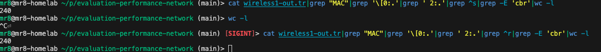

# evaluation-performance-network report

Họ và tên: Đỗ Anh Tú
Mã số sinh viên: 20021460

```bash
số node: 64
-v 1 -n 50 -t 400 -M7 -p 1 -x 670 -y 670 > 2002160.txt
```

## Bài 1

Chọn số node mạng(64): thay đổi giá trị gán cho biến nn trong wireless1.tcl (dòng: set val(nn) 3).


Sử dụng giao thức định tuyến AODV (“set val(adhocRouting) AODV”)


Sinh mẫu chuyển động (movement pattern) để sử dụng trong kịch bản mô phỏng bằng cách sử dụng công cụ setdest (version 1) có sẵn trong ns2.

```cmd
setdest -v 1 -n 50 -t 400 -M7 -p 1 -x 670 -y 670 > 20021460.txt
```

## Bài 2

### 2.1  Độ trễ định tuyến 

#### 2.1.1 Tính riêng cho từng kết nối

**Đối với ứng dụng cbr**

Thực hiện command line: 

CBR

```cmd
cat wireless1-out.tr|grep -m 34 -E '^S|DSR|cbr' | grep AGT

M 0.0 sc ./20021460.txt cp ./cbr-3-test seed 0.0
s 127.936679222 _0_ AGT  --- 0 cbr 512 [0 0 0 0] ------- [0:0 2:0 32 0] [0] 0 1
r 127.936679222 _0_ RTR  --- 0 cbr 512 [0 0 0 0] ------- [0:0 2:0 32 0] [0] 0 1
s 127.993487573 _0_ RTR  --- 0 cbr 532 [0 0 0 0] ------- [0:0 2:0 30 2] [0] 0 1
s 127.995024076 _0_ MAC  --- 0 cbr 590 [13a 2 0 800] ------- [0:0 2:0 30 2] [0] 0 1
r 127.999744827 _2_ MAC  --- 0 cbr 532 [13a 2 0 800] ------- [0:0 2:0 30 2] [0] 1 1
r 127.999769827 _2_ AGT  --- 0 cbr 532 [13a 2 0 800] ------- [0:0 2:0 30 2] [0] 1 1
s 132.160202086 _0_ AGT  --- 1 cbr 512 [0 0 0 0] ------- [0:0 2:0 32 0] [1] 0 1
r 132.160202086 _0_ RTR  --- 1 cbr 512 [0 0 0 0] ------- [0:0 2:0 32 0] [1] 0 1
s 132.160202086 _0_ RTR  --- 1 cbr 532 [0 0 0 0] ------- [0:0 2:0 30 2] [1] 0 1
s 132.161214652 _0_ MAC  --- 1 cbr 590 [13a 2 0 800] ------- [0:0 2:0 30 2] [1] 0 1
r 132.165935435 _2_ MAC  --- 1 cbr 532 [13a 2 0 800] ------- [0:0 2:0 30 2] [1] 1 1
r 132.165960435 _2_ AGT  --- 1 cbr 532 [13a 2 0 800] ------- [0:0 2:0 30 2] [1] 1 1
s 134.239939346 _0_ AGT  --- 2 cbr 512 [0 0 0 0] ------- [0:0 2:0 32 0] [2] 0 1
```
Dựa vào hướng dẫn, độ trễ dịnh tuyến được xác định cbr node 0 tới node 2 bằng:

```cmd
s 127.936679222 _0_ AGT  --- 0 cbr 512 [0 0 0 0] ------- [0:0 2:0 32 0] [0] 0 1

s 132.160202086 _0_ AGT  --- 1 cbr 512 [0 0 0 0] ------- [0:0 2:0 32 0] [1] 0 1
```

`latency_node_0_2 = 132.160202086 - 127.936679222 = 4.22352286`

**Đối với ứng dụng FTP**

TCP

```cmd
cat wireless1-out.tr|grep -m 60 -E '^S|DSR|tcp|ack'|grep '^s'

s 150.000000000 _1_ AGT  --- 6 tcp 40 [0 0 0 0] ------- [1:0 2:1 32 0] [0 0] 0 1
s 150.009112415 _1_ RTR  --- 6 tcp 40 [0 0 0 0] ------- [1:0 2:1 30 2] [0 0] 0 1
s 150.032855663 _1_ MAC  --- 6 tcp 98 [13a 2 1 800] ------- [1:0 2:1 30 2] [0 0] 0 1
s 150.033665463 _2_ AGT  --- 7 ack 40 [0 0 0 0] ------- [2:1 1:0 32 0] [0 0] 0 1
s 150.033665463 _2_ RTR  --- 7 ack 40 [0 0 0 0] ------- [2:1 1:0 30 1] [0 0] 0 1
s 150.034902062 _2_ MAC  --- 7 ack 98 [13a 1 2 800] ------- [2:1 1:0 30 1] [0 0] 0 1
s 150.035711862 _1_ AGT  --- 8 tcp 1040 [0 0 0 0] ------- [1:0 2:1 32 0] [1 0] 0 1
s 150.035711862 _1_ AGT  --- 9 tcp 1040 [0 0 0 0] ------- [1:0 2:1 32 0] [2 0] 0 1
s 150.035711862 _1_ RTR  --- 8 tcp 1040 [0 0 0 0] ------- [1:0 2:1 30 2] [1 0] 0 1
s 150.035711862 _1_ RTR  --- 9 tcp 1040 [0 0 0 0] ------- [1:0 2:1 30 2] [2 0] 0 1


s 150.000000000 _1_ AGT  --- 6 tcp 40 [0 0 0 0] ------- [1:0 2:1 32 0] [0 0] 0 1
s 150.033665463 _2_ AGT  --- 7 ack 40 [0 0 0 0] ------- [2:1 1:0 32 0] [0 0] 0 1
s 150.035711862 _1_ AGT  --- 8 tcp 1040 [0 0 0 0] ------- [1:0 2:1 32 0] [1 0] 0 1
s 150.035711862 _1_ AGT  --- 9 tcp 1040 [0 0 0 0] ------- [1:0 2:1 32 0] [2 0] 0 1
```

Dựa vào hướng dẫn, độ trễ dịnh tuyến được xác định ftp node 1 tới node 2 bằng:

```cmd
s 150.000000000 _1_ AGT  --- 6 tcp 40 [0 0 0 0] ------- [1:0 2:1 32 0] [0 0] 0 1

s 150.035711862 _1_ AGT  --- 8 tcp 1040 [0 0 0 0] ------- [1:0 2:1 32 0] [1 0] 0 1
```
`latency_node_1_2 = 150.035711862 - 150.000000000 = 0.035711862`

#### 2.1.2 Tính độ trễ định tuyến trung bình của tất cả các kết nối.

Độ trễ định tuyến trung bình = (độ trễ định tuyến cbr + độ trễ định tuyến ftp)/2 = (4.22352286 + 0.035711862)/2 = 2.12961736

### 2.2 Chi phí định tuyến

#### 2.2.1 Tính riêng cho từng kết nối

Sử dụng lệnh:

```cmd
grep '^s' wireless1-out.tr |grep 'MAC' | grep 'AODV' > send_aodv_event.txt

awk '{count[$3]++} END {for (node in count) print node, count[node]}' send_aodv_event.txt > routing_costs.txt 
```


Kết quả chi phí định tuyến cụ thể sẽ như sau và sẽ được lưu vào file routing_costs.txt:
```tr
_54_ 20
_10_ 23
_0_ 34
_33_ 26
_56_ 20
_12_ 29
_2_ 22
_35_ 29
_58_ 20
_60_ 20
_14_ 26
_4_ 26
_37_ 25
_62_ 20
_16_ 29
_6_ 24
_41_ 29
_39_ 27
_18_ 26
_20_ 27
_8_ 26
_43_ 28
_22_ 27
_45_ 29
_24_ 26
_47_ 30
_26_ 26
_51_ 20
_49_ 27
_28_ 27
_30_ 27
_53_ 20
_32_ 27
_55_ 20
_11_ 25
_1_ 32
_34_ 22
_57_ 20
_13_ 30
_3_ 22
_36_ 26
_61_ 20
_59_ 20
_15_ 24
_5_ 24
_40_ 23
_38_ 28
_63_ 20
_17_ 34
_7_ 29
_42_ 25
_19_ 24
_21_ 27
_9_ 30
_44_ 29
_23_ 28
_46_ 30
_25_ 29
_50_ 20
_48_ 22
_27_ 31
_52_ 20
_29_ 26
_31_ 28
```

Tính tổng chi phí định tuyến:
```cmd
cat wireless1-out.tr|grep ^s|grep 'MAC'|grep -E 'AODV'|wc -l
1630
```


#### 2.2.2 Tính chi phí định tuyến trung bình của tất cả các kết nối.

Tính tổng chi phí định tuyến bằng 2 cách:
```cmd
cat wireless1-out.tr|grep ^s|grep 'MAC'|grep -E 'AODV'|wc -l
awk '{sum+=$2; count+=1} END {print "Average Routing Cost: ", sum}' routing_costs.txt

1630
Average Routing Cost:  1630
```

Sử dụng câu lệnh sau để tính chi phí định tuyến trung bình:

Cách 1 sử dụng lệnh:
```cmd
awk '{sum+=$2; count+=1} END {print "Average Routing Cost: ", sum/count}' routing_costs.txt

Average Routing Cost:  25.4688
```

Cách 2: Tổng chi phí định tuyến/số dòng định tuyến

Tính số dòng định tuyến:
```cmd
cat wireless1-out.tr|grep ^s|grep 'MAC'|grep -E 'AODV'|wc -l
64
```

Chi phí định tuyến trung bình = 1630/64=25.4688


### 2.3 Thông lượng (Throughput)

#### 2.3.1 Tính riêng cho từng kết nối

**CBR node 0 -> node 2**

Tách các kết nối cbr:
```cmd
grep '^r' wireless1-out.tr | grep 'AGT' | grep -E 'cbr' > receive_events_throughput_cbr.txt
```
Tính tổng kích thước các gói tin đã nhận:
```cmd
awk '{sum[$3]+=$6} END {for (node in sum) print node, sum[node]}' receive_events_throughput_cbr.txt

_2_ 980367
```

Xác định khoảng thời gian:
```cmd
awk '{print $2}' receive_events_throughput_cbr.txt | sort -n | awk 'NR==1{first=$1} END{print "first time rec:", first; print "last time rec:", $1; print "gap time:", $1 - first}'


first time rec: 127.999769827
last time rec: 392.649651639
gap time: 264.65
```


`Thông lượng = Lượng data/thời gian = 980367 / 264.65 = 3704.3907`


**FTP node 1 -> node 2**

Tách các kết nối ftp:

```cmd
grep '^r' wireless1-out.tr | grep 'AGT' | grep -E 'tcp|ack' > receive_events_throughput_ftp.txt
```

Tính tổng kích thước gói tin đã nhận:
```cmd
awk '{sum[$3]+=$6} END {for (node in sum) print node, sum[node]}' receive_events_throughput_ftp.txt
_1_ 157218987
_2_ 158191995
```

Xác định khoảng thời gian:

```cmd
awk '{print $2}' receive_events_throughput_ftp.txt | sort -n | awk 'NR==1{first=$1} END{print "first time rec:", first; print "last time rec:", $1; print "gap time:", $1 - first}'

first time rec: 150.033665463
last time rec: 399.981098639
gap time: 249.947
```


Tính thông lượng:

`throughput_ftp = (157218987+158191995)/249.947 = 1261911.45`

#### 2.3.2 Tính thông lượng trung bình của tất cả các kết nối.

`avg_throughput_ftp =  (throughput_cbr + throughput_ftp)/2 = (1261911.45 + 3704.3907) / 2=632807.92`

### 2.4 PDR (Packet Delivery Ratio) 
`PDR=số gói tin nhận được thành công / số gói tin gửi đi từ nguồn`


#### 2.4.1 Tính riêng cho từng kết nối

**Kết nối cbr từ node0 -> node2**

số gói tin nhận được thành công:
```cmd
grep '^r' wireless1-out.tr | grep 'AGT' | grep -E 'cbr' | wc -l

65
```

số gói tin gửi đi từ nguồn


```cmd
grep '^s' wireless1-out.tr | grep 'AGT' | grep -E 'cbr' | wc -l 

71
```


`PDR_cbr=số gói tin nhận được thành công / số gói tin gửi đi từ nguồn = 65/71 = 0.915492958 = 91.55%`

**Kết nối ftp từ node 1 tới node 2**


số gói tin nhận được thành công:
```cmd
grep '^r' wireless1-out.tr | grep 'AGT' | grep -E 'tcp|ack' | wc -l

25077
```

số gói tin gửi đi từ nguồn


```cmd
grep '^s' wireless1-out.tr | grep 'AGT' | grep -E 'tcp|ack' | wc -l 

25192
```


`PDR_ftp=số gói tin nhận được thành công / số gói tin gửi đi từ nguồn = 25077/25192 = 0.995435059 = 99.54%`

#### 2.4.2 Tính PDR trung bình của tất cả các kết nối.

`avg_PDR = (PDR_ftp + PDR_cbr) / 2 = (0.995435059+0.915492958) /2 = 0.955464008 = 95.55%`

### 2.5 Goodput 

**node 0-> node2 cbr:


Số gói tin gửi ở tầng MAC từ node0 đến node2:
```cmd
cat wireless1-out.tr|grep "MAC"|grep '\[0:.'|grep ' 2:.'|grep ^s|grep -E 'cbr'|wc -l

148
```

Số gói tin nhận ở tầng MAC từ node0 đến node2:

```cmd
cat wireless1-out.tr|grep "MAC"|grep '\[0:.'|grep ' 2:.'|grep ^r|grep -E 'cbr'|wc -l

148
```




`Goodput = N_receive / N_send = 148/148`


**ftp:


Số gói tin gửi ở tầng MAC FTP:
```cmd
grep '^s' wireless1-out.tr | grep 'MAC' | grep -E 'tcp|ack' | wc -l
34808
```

Số gói tin nhận ở tầng MAC FTP:

```cmd
grep '^r' wireless1-out.tr | grep 'MAC' | grep -E 'tcp|ack' | wc -l
34782
```


`Goodput = N_receive / N_send = 34782/34808= 0.999253045`

#### 2.5.2 Tính Goodput trung bình của tất cả các kết nối.

Đếm số gói tin truyền đi
```cmd
grep '^s' wireless1-out.tr | grep 'MAC' | wc -l
144012
```
Đếm số gói tin nhận được
```cmd
grep '^r' wireless1-out.tr | grep 'MAC' | wc -l
164538
```


`Goodput = N_receive / N_send = 144012/164538= 0.875250702`


## Câu 3

### 3.1 (1 điểm) Thông lượng được tính trung bình, từ khi kết nối bắt đầu hoạt động (gói tin đầu tiên được truyền đến đích) cho đến mỗi thời điểm có một gói tin tiếp theo được truyền đến đích. (Giải thích ngắn gọn: Vẽ đồ thị như ở bài giảng của thầy, mục 4.5.1.3.1).

Sử dụng perl để tính throughput

```perl
# type: perl throughput.pl <trace file> <from node> <to node>
$infile  = $ARGV[0];
$srcnode = $ARGV[1];
$tonode  = $ARGV[2];


# we compute how many bytes were transmitted during time interval specified
$sum        = 0;
$start_time = -1;
$end_time   = 0;
open( DATA, "<$infile" ) || die "Can't open $infile $!";
while (<DATA>) {
    @x = split(' ');


    # get src_part, something like: '[0:0'
    # then split with ':'
    @parts_srcnode = split /:/, $x[13];


    # get the first part of splitter, will be '[0'
    $src = "$parts_srcnode[0]";


    # remove bracket
    $src =~ tr/[]//d;


    # get to_part, something like: '2:0'
    @parts_tonode = split /:/, $x[14];


    # get the first part of splitter
    $to = "$parts_tonode[0]";
    # checking if the event corresponds to a reception
    if (   $x[0] == "r"
        && $x[3] == "AGT"
        && $x[6] == "tcp"
        && $src == $srcnode
        && $to == $tonode )
    {
        if ( $start_time == -1 ) {
            $start_time = $x[1];
        }
        else {
            $sum += $x[7];
            if ( $x[1] != $start_time ) {
                $throughput = $sum / ( $x[1] - $start_time );
                $throughput = $throughput * 8 / 1024;
                print STDOUT "$x[1] $throughput \n";
            }
        }
    }
}
close DATA;
exit(0);
```

Sử dụng lệnh perl để lấy data
```cmd
perl throughput.pl wireless1-out.tr 1 2 > throughput1-2.tr
```

Vẽ đồ thị

```gnuplot
gnuplot> set title "Throughput of TCP Connections Over Time"
gnuplot> set xlabel "Time"
gnuplot> set ylabel "Throughput (Kbps)"
gnuplot> plot "throughput1-2.tr" w lines

```


### 3.2 (1 điểm) Thông lượng được tính trung bình trong mỗi khoảng thời gian gọi là time-granularity, được truyền vào từ dòng lệnh. Việc tính cần được thực hiện mỗi khi có một gói tin được truyền đến đích. (Giải thích ngắn gọn: Vẽ đồ thị như ở bài giảng của thầy, mục 4.5.1.3.2).

Sử dụng perl để tính granularity

```perl
# type: perl throughput.pl <trace file> <from node> <to node>
$infile  = $ARGV[0];
$srcnode = $ARGV[1];
$tonode  = $ARGV[2];


# we compute how many bytes were transmitted during time interval specified
$sum        = 0;
$start_time = -1;
$end_time   = 0;
open( DATA, "<$infile" ) || die "Can't open $infile $!";
while (<DATA>) {
    @x = split(' ');


    # get src_part, something like: '[0:0'
    # then split with ':'
    @parts_srcnode = split /:/, $x[13];


    # get the first part of splitter, will be '[0'
    $src = "$parts_srcnode[0]";


    # remove bracket
    $src =~ tr/[]//d;


    # get to_part, something like: '2:0'
    @parts_tonode = split /:/, $x[14];


    # get the first part of splitter
    $to = "$parts_tonode[0]";
    # checking if the event corresponds to a reception
    if (   $x[0] == "r"
        && $x[3] == "AGT"
        && $x[6] == "tcp"
        && $src == $srcnode
        && $to == $tonode )
    {
        if ( $start_time == -1 ) {
            $start_time = $x[1];
        }
        else {
            $sum += $x[7];
            if ( $x[1] != $start_time ) {
                $throughput = $sum / ( $x[1] - $start_time );
                $throughput = $throughput * 8 / 1024;
                print STDOUT "$x[1] $throughput \n";
            }
        }
    }
}
close DATA;
exit(0);
```

Sử dụng lệnh perl để lấy data
```cmd
perl throughput.pl wireless1-out.tr 1 2 > throughput1-2.tr
```

Vẽ đồ thị

```gnuplot
gnuplot> set title "Throughput of TCP Connections Over Time"
gnuplot> set xlabel "Time"
gnuplot> set ylabel "Throughput (Kbps)"
gnuplot> plot "throughput1-2.tr" w lines

```


